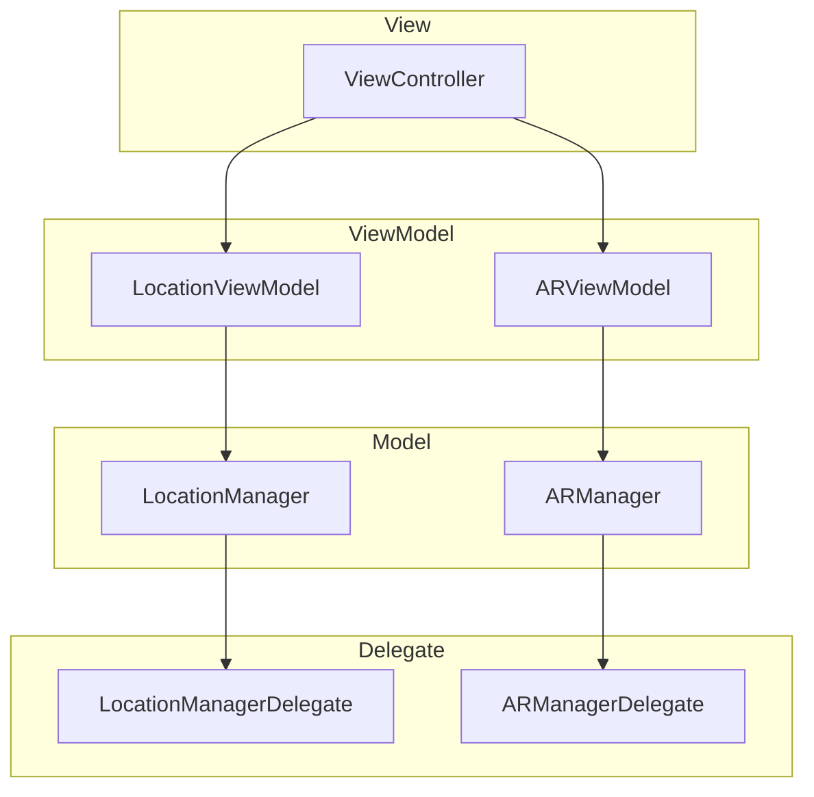
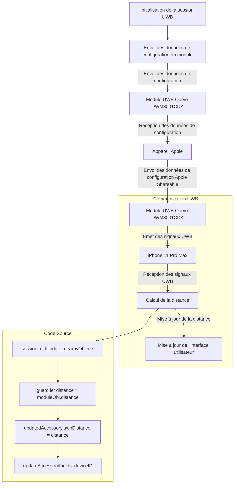

```mermaid
graph TD
    subgraph View
        VC[ViewController]
    end

    subgraph ViewModel
        LVM[LocationViewModel]
        AVM[ARViewModel]
    end

    subgraph Model
        LM[LocationManager]
        ARM[ARManager]
    end

    subgraph Delegate
        LMD[LocationManagerDelegate]
        ARMD[ARManagerDelegate]
    end

    %% Associations
    VC --> LVM
    VC --> AVM
    LVM --> LM
    AVM --> ARM
    LM --> LMD
    ARM --> ARMD


```

## Schéma d'Interaction

```mermaid


  
    graph TD;
    A1[Initialisation de la session UWB] --> A2[Envoi des données de configuration du module]
    A2 -->|Envoi des données de configuration| A3[Module UWB Qorvo DWM3001CDK]
    A3 -->|Réception des données de configuration| A4[Appareil Apple]
    A4 -->|Envoi des données de configuration Apple Shareable| A5[Module UWB Qorvo DWM3001CDK]
    
    subgraph Communication UWB
        A5 -->|Émet des signaux UWB| B1[iPhone 11 Pro Max]
        B1 -->|Réception des signaux UWB| B2[Calcul de la distance]
        B2 -->|Mise à jour de la distance| B3[Mise à jour de l'interface utilisateur]
    end

    subgraph Code Source
        B2 --> C1[session_didUpdate_nearbyObjects]
        C1 --> C2[guard let distance = moduleObj.distance]
        C2 --> C3[updatedAccessory.uwbDistance = distance]
        C3 --> C4[updateAccessoryFields_deviceID]
    end


```
